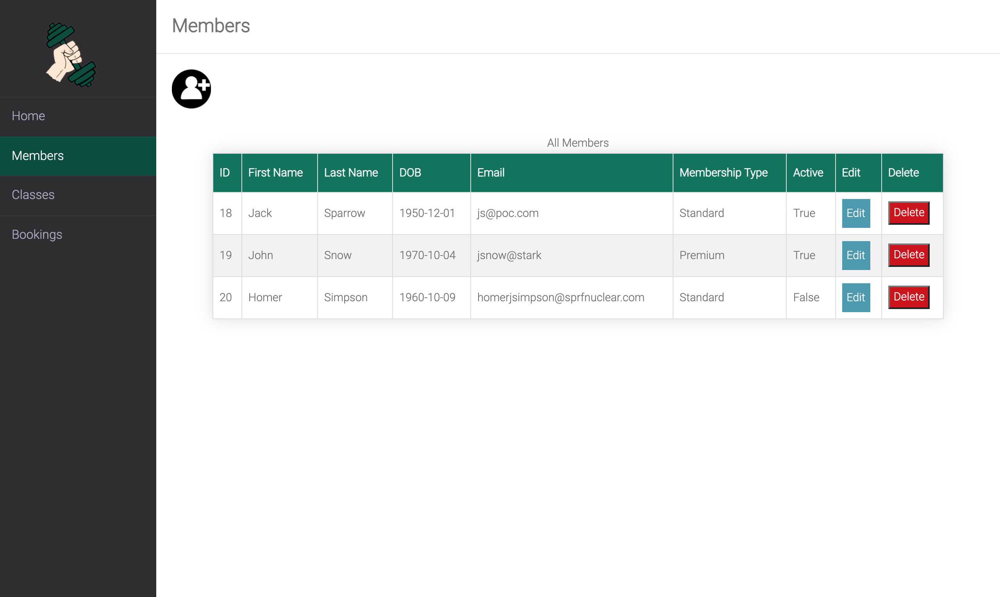
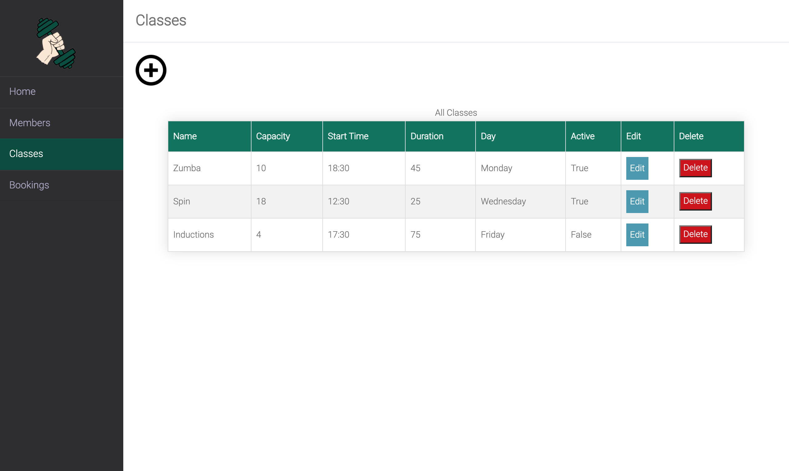
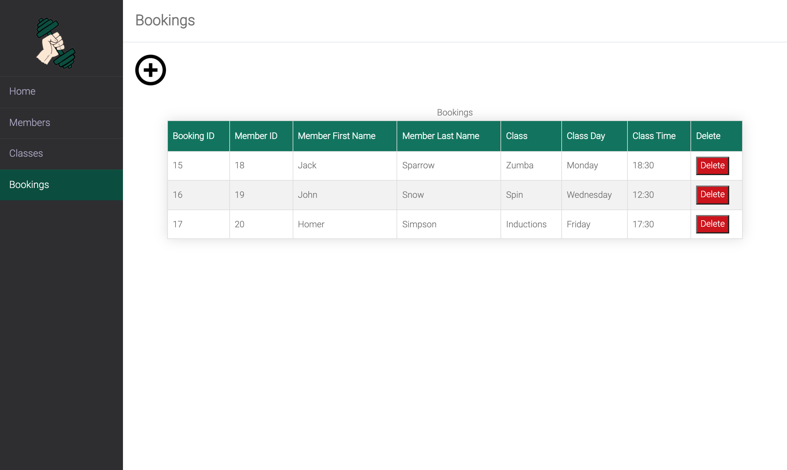

<h1>Gym Management System</h1>

First full stack solo project using Python3 with Flask, PostgreSQL, Psycopg2, HTML5, Jinja2 and CSS.

## The Brief

A local gym has asked you to build a piece of software to help them to manage memberships, and register members for classes.

MVP

- The app should allow the gym to create, edit and delete members 🟢
- The app should allow the gym to create, edit and delete classes 🟢
- The app should allow the gym to create and delete bookings 🟢
- The app should allow classes and members to be marked toggled as active/inactive with this reflecting correctly when creating a new booking 🟢

Extensions

- The app should allow classes to have a maximum capacity 🟡
- The app should show a list of all upcoming classes 🟡
- The app should show all members that are booked in for a particular class 🟡
- The app should show all classes a member is booked in for 🟡
- The app should allow for different membership types which determine the time the member can book classes 🟡

## Screenshots
Below are a select number of screenshots of the app, please see [screenshots](screenshots/GymProjectScreenshots/) for additional images.

Home Page

Members Page

Classes Page

Bookings Page

## Setup

Prerequisites

- Python3
- Flask
- PostgreSQL
- Psycopg2

Instructions

- Create database named 'gym' by inputting the following into terminal - 'createdb gym'
- From root folder of gym_project run the following command 'psql -d gym -f db/gym.sql' (Run this command twice)
- Populate database using the following command 'python3 console.py'
- Start the flask server - flask run
- Go to http://127.0.0.1:5000/

